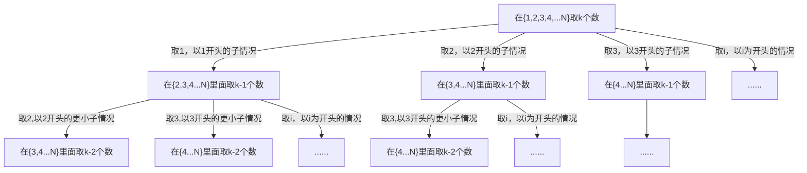
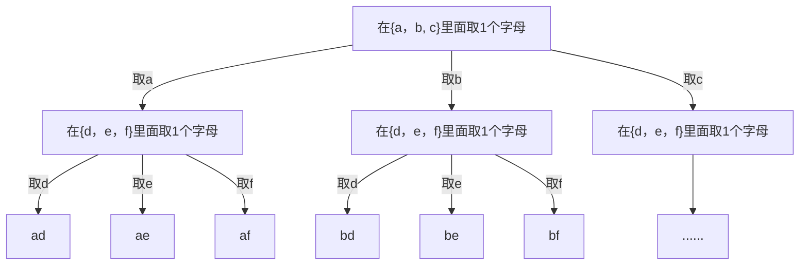
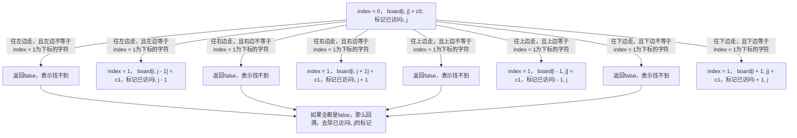
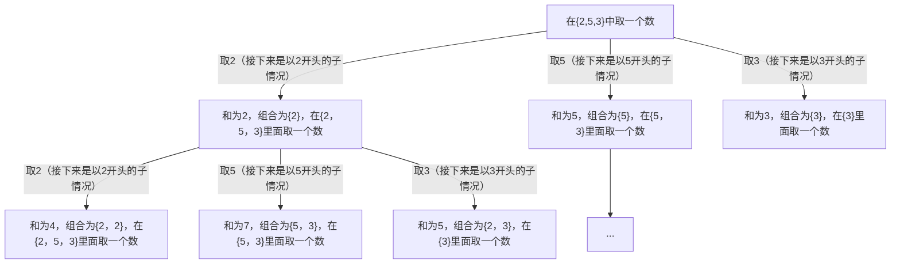
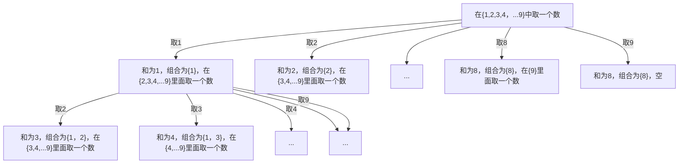

> 所有代码详见：https://github.com/jingminglake/Leetcode

# 总体思路
回溯和dfs的关系：回溯是对隐含的树结构的进行剪枝搜索，dfs是一种对显示树结构（图）进行回溯的算法。共同点是他们的解空间都是树结构。区别是，回溯的话，树是隐含的，而且通常非常大，所以回溯策略就是进行剪枝，对有些走不通的路，会回到之前状态然后继续寻找能走通的路，且每一步访问的结点都是动态生成的。

对于明确的树结构，使用dfs，不需要特殊的回退策略就可以对一个结点所有邻居一个一个的进行访问。

对于隐含的树结构，当前结点是动态变化的， 也就是说，当前结点的值是根据上一步的状态得来的，所以退到上一步的时候需要把状态还原成进入结点之前的状态。所以也就不存在像dfs可以把每个结点都打上标记那么奢侈。所以，dfs是一种全图搜索的算法，而回溯只是一种剪枝找路径的策略。dfs看上去就是更容易操作的回溯。

找所有的满足某条件的方案，或者是求排列组合，那么使用DFS。DFS过程的理解：就是树（此时树不仅是二叉树，而是多叉树）的先序遍历。所以时间复杂度就是树的结点个数乘以每个结点处理时间。例如求组合，那么树的结点就是2^n个。DFS一般使用递归来实现。

递归三要素：递归的定义、递归的拆解、递归的出口。

题目有解空间，多种选择选一种后递归，还需要知晓路径，基本都是要使用DFS解题。如果解中含有大量重复，那么此时考虑：能不能从底向上去解题，如果可以，说明此题可以动态规划来解，如果不可以，那么可以使用记忆化搜索：把计算过的值存下来。

回溯的题型：

(1)  找路径
先考虑从一个点到另一个点之间是否存在一条路径，存在的话，路径是什么这类问题。解法就是递归实现的深度搜索，当前结点能否到达递归到他的所有邻居中有没有可以到达的。第一个问题就是自己也是邻居的邻居，所以需要使用visited数组，标记走过的点。

第二个问题是vistited的结点要不要在某个时刻去除：答案就是看当前的图是不是满足“灌水”的性质，如果是灌水性质的，那么vistited的结点不需要“回退”。例如矩阵中从一个点出发向外找另一个结点的情况，我们发现这是“灌水”性质的，也就是说，找的时候是一个中心向外辐射（fan out）的，也就是说一个点只需要被访问一次，走其他路径不需要经过之前已经访问过的结点（如果经过，那么显然不是最优的），也可以说是不会出现递归卡壳（get stuck）的情况就可以找到一条满足条件的路径。

相反，不存在灌水性质的，例如需要找出一个点到另一个点的所有路径，此时很有可能之前访问的点在走另一个方向也会经过，此时就需要对之前的路径进行“回退”。

灌水性质的题目例如：求岛屿个数、二维矩阵迷宫路径、给地图上色。

如果是寻找一个点到另一个点的所有路径，那么就不具有灌水性质。

PS.dfs找特殊路径的题目，例如路径长度被限制，或者最长、最短，实际上还是找全部路径，然后在里面挑一个最合适的，也就是说，往往是非灌水性质的。

(2) 构造型
当前结点下一层有几种选择，选了之后，会消耗掉一些可用的值，然后发现结点其实就是信息+状态。

根据当前结点构建下一层的结点，当访问的达到某一个深度的时候，返回作为答案。其中的信息+状态使用的空间可以是线性空间，技巧就是在下一步走完之后，走回之前的位置，也就是还原成上一步的状态，然后向另一个方向走。如果走错了方向，更多的可能是把下一次要走的方向上的可能结点也标记为已访问了，所以此时需要做的就是退回之前的状态，把沿途经过的已访问的全部还原成未访问。

构造型的答案，往往是某一深度的所有叶子结点，或者是整个图的全部结点（每个结点访问一次）。

例如：子集、排列（旅行家问题：旅行家问题解法是求排列，然后选择最小的路径和的那个排列，可以在dfs的过程中进行剪枝）、扫地机器人、N皇后。
回溯需要visited数组来保存访问过的点，不过这样有额外空间，有一个节省空间的技巧就是直接修改原来的图结构，例如二维矩阵上就是修改值。在回溯的时候，在把值改回来就可以了。 另外一种不能使用这种技巧的情况就是，有时候是返回bool，可能会提前终止返回，也就是说没有办法还原原来矩阵了。在进入当前层之前加上visited标记，不需要在访问子节点的时候去除visited标记，因为循环能保证当前层的几个分支都执行，也就是说回溯到当前结点时候不会出现被visited阻塞住进不了下一个分支的情况。

dfs深度：有些深度是潜在存在的，例如字符串求子集问题里面，字符串长度就是搜索深度。

dfs下一层有多种选择的时候，访问一个方向的标记有两种写法，第一种是，访问方向之前给结点打上标记，然后访问，访问完之后去掉标记；另一种是进入结点后立即打上标记。
区别就在于：
- 进入下一层一开始的时候，会不会对访问标记有要求，例如二维矩阵上省空间的时候，会使用特殊字符来取代原来字符，然后会还原。此时，如果使用提前标记，那么万一下一层一开始的时候需要访问该位置原字母，那么一定会出错。
所以，使用提前标记的原则就是，保证下一层的访问是绝对不受影响的。
无论如何，总原则就是下一层不能选上一层已经访问的元素。

- 对空图的支持情况不同，如果图初始为空，有可能不能提前打上标记。

## dfs解决的问题分两种基本模板

所有的dfs解决的问题，都要使用两种最基本的模板（或者是其变形）：求组合（子集）的模板、求排列的模板。遇到dfs问题第一步就需要分析该问题本质是排列还是组合。

### 组合（子集）

组合于排列的区别理解可以这么理解：朝三暮四（先选3再选4）{3, 4}与朝四暮三（先选4再选3）{4，3}是等价还是不等价的，

如果是等价的，那么是组合问题，如果不是，那么是排列问题。

例如求子集时候，{3, 4}，{4，3}被看做相等。

组合问题为了在已经考虑{3, 4}的情况下避免掉{4，3}的情况，可以使用一种经典模板，就是必须以第i个元素为开头的子情况，这保证了在第i种情况已经选择的情况下，才能选后面第i+1, i+2...种情况。

例如n个数里面选k个数:

组合树的分治原理：分解为以每种元素为开头的子情况，下一层的元素选择范围是这种元素之后的所有元素。

结果是搜索的路径：按树的层来看，第一层是0个元素的组合情况，第二层是1个元素大小的组合情况，依次类推。

### 排列

排列的模板的问题：旅行家问题，先访问A城市，再访问B城市和先访问B城市再访问A城市不一样，算两种结果。

排列的树结构特点是层次感很强（元素先后，也就是下标是有意义的），每一层的选择是之前路径上没有选择过的所有情况即可。

排列树的分治原理，可以这么理解：排列是分层的，每层的结果一旦固定了，那么接下来的问题就变为子问题了。

模板参考n皇后。定义一个层次level，计算dfs(0)，在dfs里面一开始规定，到第n层的时候，把一种排列路径记录下来。

## dfs时间复杂度

一般来说，就是O（V+E），每个点访问一遍，且不走回头路，也就是说边不会访问超过两次。

点的数量也就是解空间：排列模板的解空间是n的阶乘，组合模板的解空间是2^n（理解：每种元素选或不选两种情况）。

求子集的时间复杂度：n个元素，每个元素具体选和不选的情况决定了一个子集，所以总共有2^n个子集，然后每个子集都需要加入结果数组里面，每次消耗n的时间，所以时间复杂度是O(n*2^n)。

求组合的时间复杂度：n个元素选k个，那么就是C(n, k)，然后每个结点要记录组合情况，花费k的时间，所以时间复杂度是O(C(n, k)*k)。

# 边界测试情况

- 图是否联通，不联通会如何
- 题目给出的图结构是否保证合法：例如无向图表示是否具有双向边关系
- 图是否存在环，存在会如何

# 具体题目
### 78. Subsets
**题意**：给出一个只含有不重复整数的数组，求所有子集。

**解**：此题本质是求组合。

解法一：经典子集模板。以\[1,2,3]为例： dfs(0, 2)当作数组{1, 2, 3}的解，它递归为必须第一个元素1为开头 + dfs(1, 2)，必须以第二个元素2为开头 + dfs(2, 2)，以及必须以第三个
元素3开头+ dfs(3, 2)，显然，dfs(3,2)中3已经越界了，这种情况作为基本情况直接返回。

编码过程中，我们在第一层先把这3个子问题摆上。子问题在下一层中也要巧妙的摆上它的子问题，方法就是：由于我们知道当前层的是以哪个元素为开头的情况，那么可以把当前层的开头元素的下一个
元素的下标传给下一层，下一层使用它定义子问题的开头。

但是注意他们是实际访问顺序是深度优先的，也就是说，必须第一个元素开头的问题解决了，才会回溯回去解决开始必须第二个元素开头的问题。
在必须以第一个元素开头的问题解决过程中，也会遇到必须以第二个元素为开头的子问题和必须以第三个元素为开头的子问题，但是注意，此时的子问题是下面层的（也就是基于选择1的前提下）。
所有的边界，都是发现了dfs(3, 2)这种越界情况，然后返回空，表示该以3为开头的子问题已经解决了，程序逻辑跳回到上面一层（递归返回）。

经典模板搜索的时候，子集里的元素并不是位于最后一层的结果，而是搜索树时候每一步临时变量。

解法二：直接对组合空间2^n进行暴力求解，也就是对于每个元素，考虑选还是不选。

从空开始，第i层有两种选择：选该层元素或不选。最终的结果是所有的叶子节点，也就是搜索树的最后一层。

**结论**：推荐使用第一种方法，因为：

1. 第一种方法扩展性比较好，例如元素重复的时候，直接暴力求解方法就失效了，因为此时解空间并不能完美对应2^n。

2. 第一种方法时间复杂度比较好，第二种的结果在搜索树的最后一层也就是叶子上，而第一种方法的每个节点都是一个结果，因此搜索树更加小。

**PS.**

3. 子集模板的最大特点就是通过不选之前元素来保证去重功能。

4. follow up：解法二的非递归如何解。非递归时候，是使用二进制一一对应的解决，1表示选，0表示不选。即组合题目不考虑数字重复的情况下可以对应二进制。

感想：对于一题多解究竟好不好，回答就是，多解和问题本身无关，不需要纠结其中。解题中最重要看到问题的本质解空间，至于如何利用其中的数学特点快速找到想要的解，那就是有各种的套路了，套路多才能多解，且一种套路往往在题目间是通用的。

### 17. Letter Combinations of a Phone Number
**题意**：数字加拼音的键盘，给出数字，求字母的组合。

**解**：此题看似是组合，但更接近使用排列的模板（不是排列），因为每个位置是固定的。

此题的解空间为这样的一棵树：根节点为空，第一层三个节点分别是第一个数字对应的3个字母，第二层是选择第二个数字对应的字母，以此类推。每一个从根到叶子节点的路径就对应一个解。

使用下标index记录搜索的层数，当index等于数字字符串的长度的时候，知道已经是到叶子了。
使用字符数组记录path，也就是搜索路径。
在index和树高相等的时候，记录下答案，并回溯。

以“23”为例：

### 46. Permutations
**题意**：求数组全排列。

**解**：回溯。第一层代表当前层可选的数字，第二层代表当前层可选的数字，那么结果在叶子层。当前层可选元素是尚未选择元素（使用访问数组记录已经访问过的数字的下标），那么剩下的元素变成了一个子问题。
使用层级（start，level之类的）表示的其实是一种分治的思想，把问题给分解小：选了当前元素后，后面子问题缩小了，同时start每次加1，等于树高的时候，说明当前层就是叶子了。
求subset时候，下一层的选择是所有以某元素为开头的子问题，层数代表了子集的元素个数。
### 47. Permutations II
**题意**：46题基础上，加去重。

**解**：当前层级选择的范围是0到size-1，在此基础上去重。

去重条件是在当前层考虑的元素和前一个元素相同的情况下，如果当前元素没有被访问过，而前一个元素已经被访问过，那么可以继续访问当前元素。

也就是说，元素相同时候，前一个元素被访问了，才考虑访问后面的元素。否则如果之前元素并未被访问，那么当前元素不能选。这么做的原理是：例如{1，1，2}，结果路径中包含{1，1，2} 和{1，2}，如果第二个1在第一个1访问时候加入，那么会产生{1，1..}这种效果，否则如果第二个1在第一个1未访问的前提下加入，那么会产生{1，2}这种效果，但是{1，2}在之前的1的时候已经考虑过了。

注意：先要排序。
### 526. Beautiful Arrangement
**题意**：给出1到n的数，求排列，只要每个都元素满足nums\[i] % i == 0或者i % nums\[i] == 0，那么该排列称为Beautiful Arrangement.

**解**：此题就是回溯，其实是排列题的变形，在排列的时候，对于一个层次里面选元素多了限制，除了不能选已经选的以外，还要满足互相余有一个为0。
### 90. Subsets II
**题意**：78题基础上去重。

**解**：先排序。
对应78解法一（推荐），然后对于重复元素，选择第i个元素的时候，也就是在一层访问的时候，对其中的可选的元素，如果有重复，那么只能选择一个（选择第一个）。一开始需要排序。

对应78解法二，那么对于重复结点那一层，只有在之前重复结点是被选的情况下，才会选，否则，直接跳过，考虑下一个层次。编码的关键是当前层不选的情况下，如果当前层元素等于上一层元素，那么跳过当前层。
### 490. The Maze
**题意**：迷宫里，只能一个方向直线走，遇到障碍物才能改变方向。求能不能从起点走到终点。

**解**：迷宫的本质是一个排列问题。
使用DFS，DFS过程中，要把当前方向的能走的全部吃掉，撞到墙或者出界的时候回退一格，对该格子尝试所有可能方向，也就是说这样靠墙的最后的一个格子就是下一层的起点。如果从一个格子考虑了各方向的DFS，那么要把该点标记为已经访问过了。下次就不可以将这些格子作为起点了。
如果访问中某个起点就是终点，说明终点是可以停靠的，否则如果处于被吃掉的中间格子，那就不可停靠。
### 79. Word Search
**题意**：字母矩阵里面找单词。

**解**： 此题关键点：

1. DFS的起点是矩阵里面所有跟单词第一个字符相等的位置，只要任意一个位置可以DFS搜到单词，就说明可以找到。
2. 定义搜索深度变量index，它等于当前搜索字符串长度，当index等于单词长度的时候，说明找到了。
3. index = i的时候，先保证单词第i个字符与当前这一个坐标对应的单词是相等的，否则不需要继续了。
4. 如果相等，那么就继续看i + 1的部分，分为四种情况（上下左右），看之前先把当前坐标标记为访问过（不标记则会返回自己导致死循环）
5. 要回溯。在以选择自己后的4种情况计算完之后，要把自己恢复成未访问，这样让以其他结点为起点的搜索情况能否顺利穿过自己。

以矩阵里面的(i, j)处元素与单词第一个字符相等为一次DFS的例子：

PS. 此题和490迷宫题的区别在于，不存在一个方向走，走到不能走再转向的问题，而是只要是能走的地方，能随时转向。

### 339. Nested List Weight Sum
**题意**：嵌套数组，每一层的权重与当前层深度对应，求带权重总和。

**解**：此题使用dfs，每一层传入加1的深度即可。

### 364. Nested List Weight Sum II
**题意**：嵌套数组，每一层的权重与339题相反。

**解**：此题思路就是将嵌套数组当作二叉树类似的结构来看。

方法一：先计算每个节点的高度，然后之后在对每个节点乘以它的高度，但是这样空间复杂度较高。有一个技巧是，使用树高度作为key，对在遍历时候对每一层收集和，之后在对每一层计算乘积加在一起。

方法二：使用BFS进行的层序遍历（类似二叉树层序遍历操作）。不同之处在于，每一层的总和并不清空，而是下一层中继续用到，这就是技巧所在：只要有新的层存在，那么老一层必然新加一倍，完美符合题意。

### 254. Factor Combinations
**题意**：找出正数n的因子乘积等于自己的组合。

**解**：子集模板的dfs，难点在于排除掉重复情况，例如\[2,2,3]和\[3,2,2]重复。

方法一：对于n的所有因子从小到大（不包括1，但是包括n）作为分解起点进行考虑，当分解的剩余值为1的时候，也就是自己余自己的时候，那么将路径上的用来分解的因子加入总结果。排除重复的关键在于，每次对剩余值继续分解的时候，要以之前分解值作为起点，也就是不能选择比之前使用过的因子值小。例如，12以3为因子分解为4的时候，4需要以3为起点进行因子选择，因为如果4拆成2和2，那么3，2，2会和之前的2，2，3重复。在以32为例，自己作图，其中发现32按4分解为8的时候，8选择4分解为2，此时由于2要以4开头，那么其实此时的2是无法继续分解变成1的，也就是说这种路径不需要：实际上这种4，4，2的组合和之前的2，4，4组合重复了。

方法二：对于n的2到小于等于n的平方根的因子进行考虑，选择一个因子后进行分解，首先，剩余值不可能小于因子，因为因子的平方比n小，这样设计的原因是如果剩余值比因子小，由于剩余值也是因子的一种，那么我们知道这种情况意味着此时的分解组合是重复的。
相反，如果分解的剩余值比因子大，那么（1）当前因子和剩余值可以作为组合的一种加入答案；（2）需要将剩余值作为相同问题子问题来解因子从之前分解的因子为起点。结果对应搜索路径的每一个结点。
再来分析上面的是否需要将剩余值作为相同子问题来解，这就要看剩余值r是否大于因子f的平方了，如果大的话，那么一旦剩余值 r % f == 0，那么接下来的剩余值r / f 必然大于r了，这样如果仍然选择当前因子或者比当前因子大的值继续做子问题计算必然会出现重复的情况；相反，如果小的话，那么需要作为子问题继续计算。这种情况的实例可以使用数字18来分析。

### 464. Can I Win
**题意**：两个人在1到i（i <= 20）中不重复的交替选，选出来的值加到总和，看谁先选到一个数使得总和到达或者超过desiredTotal就算赢。现在要计算给定了i和desiredTotal，看第一个取数字的人一定会输还是赢。

**解**：先判断此题是组合问题还是排列问题。显然顺序是重要的，先选特定元素对最终胜利结果是相关的，因此此题是排列问题，采用排列模板。

递归思路是：玩家先手时在可选的选项中选，选完后，问题变为对方先手的子问题，子问题知道结果后，再进行回退，尝试选新的数，在看基于新选数的结果。

接下来的考虑的是：（1）如何知道下一层中的可选项。

可以使用一个bool全局数组，每个数字一旦使用过，那么标记到bool数组中。回退时候，前去掉当前标记。

（2）能否通过记忆化搜索去重。

这点需要深刻理解此题数学结构才能得出结论：此题子问题依赖的是之前所选的值的和，而我们知道此题是排列题，也就是说，之前所选的值其实是排列，

也就是说，所依赖的选值中，存在大量重复，例如{玩家1选1, 玩家2选2}和{玩家1选2, 玩家2选1}，它们总和为3，对后续序列结果完全相同。因此结论是可以使用记忆化搜索去重。

记忆化实现方法是使用hash表记录（1）中bool全局数组的状态，也就是作为key（bool型的数组转化为string型）。

使用后，时间复杂度由排列减少到组合，也就是拆分为2^i种组合状态，每个状态需要i的时间来做处理（对i个数做加减法处理），时间复杂度为O(i*2^i)。

解题思路总结：使用DFS+backtracking+记忆化搜索。

PS.  
- 先手能获胜的逻辑

正常逻辑：当前层能选到比desiredTotal大的值，或者自己在所有可选情况中选某个之后，存在下一层中对手先手都无法获胜的情况出现（因为自己先手之后无法决定之后对方的先手情况），  
如果所有可选情况都无法，那么无法获胜。

这种逻辑实现起来也较复杂。

有个优化但是有点绕的逻辑：本来是在当前可选A、B、C情况下，是自己先手选A、B或C，考虑选择之后，对手先手的所有情况。

**但是，其实可以这么想**：假设此时是对方先手在选A、B或C，此时只需要其中任何一种情况无法获胜，则视为当前情况下自己获胜。

注意，此逻辑实现的时候不能使用path记录搜索路径的方式，因为搜索路径违反了这种逆向思维。实现时候应该依靠分治逻辑，专注于把大问题拆小，解决子问题。

- 可以使用bit操作来优化空间

由于i小于20，所以bool全局数组可以替换为一个int（使用int的bit位）used，标记为true对应到int就是把1上到int对应的位置即可。

具体操作：used初始值为0，先构建一个第i位为1，其余位为0的int型cur。之后，

（1）如果想验证used的第i位置是否为1，那么使用cur和used进行与操作，看是否是0即可；

（2）如果想在used该位置上加上1，那么只需要cur和used进行或操作。

不需要去除操作，每次只需要使用参数深拷贝就行了。

### 39. Combination Sum
**题意**：给出一个数组，里面是正数（不带重复），再给一个正数target，求所有和为target的组合集合。元素可以重复使用，但不允许组合重复。例如：[2,2,3]和[2,3,2]是属于重复的。

**解**：[2,2,3]和[2,3,2]是属于重复的，也就是先选2再选3和先选3再选2是等价的。

说明此题本质是组合，但是差别在于可以多次使用一个元素，也就是说，以某个元素为开头的子情况里面，继续可以以该元素为开头。另外，此题没有k长度的限制，也就是每个节点都有可能是答案，而且要截枝，不然无限递归了。

使用path记录搜索路径，sum记载当前搜索路径的和，每次看sum等不等于target，如果相等，那么说明找到一种。
也可以保持一个remain表示剩余值，如果为0，说明到达target，如果当前元素已经比remain大了，那么说明没必要继续递归下去，可以进行剪枝。

需要配合remain，当前下标不满足条件后在进行下层下标的计算。

PS.此题不需要先排序。

以[2,5,3]，target为4为例。

时间复杂度简单分析：搜索树的高度H是有限的，那就是 target / 集合里面最小的数，然后每一层最多是集合元素的指数增长，也就是 N + N^2 + N^3 + ... N^H = N^(H + 1)。

### 40. Combination Sum II
**题意**：此题和39题区别就是可以包含重复数字，但一个元素只能用一次（一个元素实例只能使用一次，而不是说元素的数值）。

**解**：此题与39题相比的关键是要先排序，举个不排序的反例子：原数组：\[1,7,1], target = 8, 那么\[7, 1]和\[1, 7]会被算作两个结果。然后，去重的过程就是如果之前1未访问的情况下，那么下一个1不能访问了了，因为会出现\[1, 7]和\[1, 7]的重复。但是对于第一个1已经访问的情况，是可以考虑第2个1的。

此题本质其实是子集II（带重复），只不过，多加一个当前剩余target值，如果target为0，就将当前path加入res，target小于0直接剪枝返回。

### 216. Combination Sum III
**题意**：与39相比，现在是从1到9中不重复的选k个数，和等于target，求组合。

**解**：本质是求组合，当选择的数量达到k后，那么不再往下递归了，可以直接剪枝。

使用path数组记录当前搜索路径，如果当前路径深度已经是k了，那么就看和是否是target，如果是，那么是合法的path，
记录到最终的result数组里面，否则提前返回。path数组每次当前层结束后要回溯。
使用sum记录当前搜索路径的和，每次需要回溯，减去直接当前层的大小。

另外，还有优化技巧是：从数字1到9递增遍历时候，在下一层选择范围中，如果接下来的可选总和(i*k + k*(k-1)/2）小于target，那么无需进入下一层了。

### 698. Partition to K Equal Sum Subsets
**题意**：看一个数组能不能找出k个集合，k个集合和相等，即把数组等分为k份。

**解**：此题可以使用排列，也可以使用子集，但是正确来讲，此题的数学模型应该是组合，也就是子集模板。且组合（子集）时间复杂度2的n次方明显比排列n的阶层要小得多。

组合法：使用求子集的搜索模板。先考虑第一步：给出一组数（非独特），是否存在一种组合（子集）情况，组合（子集）的和等于target（target等于数组和除以k）；

第二步：将第一步子集之外的所有元素作为新数组，进行新的子集寻找，此时相当于是子问题，但是要注意的是此时的层次比上一步要高一层。

由此思路带来的具体解法就是：进行子集构造，且把已经访问的结点加入visited数组，这样，在进入求target的新的一层后，可以从0开始，中间跳过被visited的元素进行新情况下的子集构造。
也就是说visited数组技巧就是为子问题编程时候打下方便。

理解：此处的子集构造并不是指真正的求子集，而是指使用子集的搜索模板，每次选择一个元素后，本质是构建了一个子集。

排列法（仅供参考）：使用排列模板dfs+memo。先计算出每一层的目标target = sum / k。之后，每当一层的目标被满足后，就进行k-1递归进入下一层搜索，递归的基点就是，当前的目标是0，k等于1，且所有节点被访问到，由于每一层都是有target，所以target = 0， k = 1的时候，其实可以不用考虑所有元素是否被访问，因为所有元素一定是被访问且只访问一次的。有一个子问题可以解决则返回true，如果全部都不可以则返回false。

每一个搜索节点是若干信息的组合：所在层数k，以及数组被visited的状态（可以使用string来标记的技巧，也就是使用“01”的串来表示，‘1’表示已经访问，‘0’表示未访问，string可以作为hashmap的key,比vector作为key效率高），当前的target，其中后两者的信息是可以互相推导的，所以总的来说每个节点可以用二维信息来标记。
如果k为0，直接返回true，或者之前的（k，状态）被访问过，那么返回记录结果，否则进行dfs，
可以先排序，从大到小，这样能尽快的递归到k-1层。
特殊测试用例：sum总和为0的时候，对于不同的k，有时候有答案，有时候没有。

PS.二维hashmap的写法就是，将一个维度的信息作为key，然后指向另一个一维的hashmap作为值。

### 51. N-Queens
**题意**：NxN棋盘上，放N个皇后，皇后之间不能相互攻击，求所有情形。皇后的攻击是横竖或两个对角线。

**解**：dfs问题一定先搞明白是排列还是组合，以便套模板。此题典型的排列题，也就是n个Q的排列，也就是n层每一层放一个Q，每次Q的放入有n种列选择的情况。

与普通排列题关键区别是如何判断能不能落子。

由于逻辑复杂，因此使用单独的函数来判断是否能落子，传入的参数是当前的path，也就是棋盘的整体情况以及当前落子的坐标，以及棋盘大小。

(1) 对当前列扫描，如果存在皇后，那么返回false。行不用考虑，在搜索时候，每行只会放一个皇后。

(2) 45度对角线判断上面几层是否有皇后。45度对角线判断方法就是：往左上角走，也就是每次走(-1, -1)，然后只要保证不越界就可以(i,j都要大于0)

(3) -45度对角线判断上面几层是否存在皇后。判断方法一样，向右上方向走，也就是（-1，1）。越界情况略有不同，那就是(i大于0，j小于n)。

如果3个循环都没有检测到皇后，那么返回true。

另外还有一种检测对角线皇后的方法，由于第i行之前一定只会存在i-1个皇后，那么我们使用row\[i] = j数组来记录之前i-1个皇后的位置，然后一个个看之前皇后点，与当前检查的位置与组成的与行列平行的直角三角形是不是等边的，如果是，说明落在了对角线上。
等边判断：（1）135度等边：y - y1 = x1 - x; 转化为 x + y = x1 + y1。
（2）45度等边： y - y1 = x - x1; 转化为 y + x1 = x + y1。

推荐第一种检测方法，使用Q来替换'.'来标记结合直接扫描。

### 301. Remove Invalid Parentheses
**题意**：删除最少的')'和'('，使得string合法。string中可以有其他字符。

**解**：
方法一：bfs层序遍历，每次移除一个左括号或者右括号，进入下一层，如果下一层中一个是合法的，那么把当前queue都弹出并检查一遍，并退出。注意：一开始要检查原始的字符串是不是本身就是有效的。

方法二：第一步先求出要最少需要删除的')'和'('的个数。方法是：维持两个变量，然后扫描字符串，如果遇到左括号变量，左括号变量自增1，如果遇到右括号，且左括号变量不为0，那么左括号变量自减1，否则右括号变量自增1表示该括号消除不掉。扫描结束后，左括号数仍可能大于0，也表示删除不掉。
第二步，递归移除左右括号来看是否合法，也就是问题递归为该串每个位置上删除掉，之后的left或right减小的子问题。递归的出口就是左括号和右括号变量都为0且剩余子串合法，且把此时的串作为答案之一。防止重复移除的方法：（1）遇到连续的左或右括号，那么只算第一个括号，因为都是等价的。（2）对重复的串加入hashSet，遇到一样的就不计算了。
### 785. Is Graph Bipartite?
**题意**：以邻接表（但是表示为矩阵）方式给出图，检查该图是不是二分图。PS.题意给出的图的顶点数量是graph.length

**解**：二分图的概念就是，图中分为两个集合的顶点，两个集合内的顶点互相没有连接，而只与另一个集合的顶点发生连接。
解题方法之一就是dfs，对于未访问的结点访问，并随机放到一个集合中（打上集合A的标记），然后尝试将他的所有邻居标记为集合B，如果该邻居已经标记为集合A了，那么说明该图并不是二分图，否则，如果没有打过标记，打上集合B标记，如果已经打上B标记，那么说明已经访问过了，直接返回。

注意：对每个顶点都要为起点进行dfs访问，因为图不一定是连通的。

### 282. Expression Add Operators
**题意**：给出数字，求数字之间加上加减乘除等于target的所有情况。
"123", 6 -> \["1+2+3", "1*2*3"] 
"232", 8 -> \["2*3+2", "2+3*2"]
"105", 5 -> \["1*0+5","10-5"]
"00", 0 -> \["0+0", "0-0", "0*0"]
"3456237490", 9191 -> \[]

**解**：此题是dfs。注意的点有几点：

（1）以0开头的，长度超过2的数都不合法。

（2）开头的一个数字不加任何符号，所以dfs函数是单独写的。

（3）要保存当前的计算值，和之前的计算值。

如果遇到乘法，就要先减去之前的值，来还原前一个处理的数，例如2+3\*4 变为 5-3 + 3\*4，这个例子中，遇到乘法时候，当前值是5，之前值是3，计算之后的之前值是5。例如1-2\*3变为 -1-(-2) + 2\*3，遇到乘法时候，当前值是-1，之前值是-2，计算之后当前值是2\*3 == 6。
### 332. Reconstruct Itinerary
**题意**：有一堆机票，从jfk出发，求用完机票走过的机场顺序，如果一个起点有两个选择，那么先走字母小的机场。
此题保证至少有顺序路径是合法的。

**解**：此题本质是联通（题目已经保证了）有向图边的遍历，也就是一条边只访问一次的一笔画问题。一般顶点遍历路径中顶点只出现一次，而一笔画顶点遍历路径不同，图是动态更新的，也就是说顶点加入的路径的时机并不是所有邻居访问完之后，而是有可能在第一个邻居访问的时候，图就被修改导致第二个邻居还没有访问的时候，当前顶点就需要加入路径了。

一笔画问题边的遍历，就是从一个点出发，把出发的边删除，路上经过的所有点只要有出路，那么不记录，如果没有出路（一个出边都没有），那么才能加入顺序路径，也就是说，从起始点字母顺序高的邻居尽可能深的遍历，等到走不通了，就开始回溯，并把终点加入到结果中。记录的顺序与所要求的顺序结果是相反的。
PS.
- 举例：
{JFK -> A, JFK -> B, B -> C, C -> JFK}

=> { JFK, B, C, JFK ,A }

- 字符串数组按字母顺序排序且可以快速删除的数据结构
C++的multiSet和Java的PriorityQueue。

### 211. Add and Search Word - Data structure design
**题意**：可以加单词和搜索单词。搜索时候可以使用'.'来代替任何一个字符。

**解**：由于要搜索，所以此题适合使用trie树，不同之处是可以使用'.'来代替任何一个字符。

搜索时候，如果出现了'.'，那么dfs，把当前指针的下一层都当做与'.'匹配的来看，并进入下一层搜索。注意的是：这种做法只能使用返回true，false，不能返回最后字母所在的指针，因为对于'.'，它的下一层指针必须是word才能返回true，如果直接返回不空指针，那么可能该指针不是word。
### 638. Shopping Offers
**题意**：\[2, 5], \[\[3, 0, 5], \[1, 2, 10]], \[3, 2] 。其中第一个数组表示物品A和物品B的单价，第二个数组表示特价清单，\[3,0,5]表示可以使用5的价格购买3个A，0个B。最后的\[3,2]表示需要购买3个A和2个B。现在求如何购买花的钱最少，最少钱是多少。注意：物品不能买多或者买少，而是恰好买到需要的件数。

**解**：此题不需要考虑特价不够优惠的情况，所以策略就是有特价尽量买特价。所以此题是dfs回溯的暴力求解，dfs的下一层的改变就是在选择了一个特价元素之后，对于需求数组的改变和对总体花费的改变。特价的选择数量决定了对于一个结点有几个分支，所以在所有分支访问完之后，需要返回，所以dfs的技巧就是设置index，在index到达选择数量的尽头的时候，就返回。
顺便说一下，dfs和回溯区别就在于回溯是更通用的算法，而dfs是树结构(如果是图，那么也是选择一点当作树的root)的回溯算法，对于每个分支尽可能深的搜索。
此题搜索所有分支后，如果还有剩余，那么剩余的按原价买。对于一个特价分支，在可以买的前提下，看买和不买哪个更加划算，买的话，分支种类不变，如果选择不买，那么分支是要加1的。
### 802. Find Eventual Safe States
**题意**：给出一个有向图，找出其中的安全结点，所谓安全结点，就是指从它出发走K步，无论怎么走，走不到K步就会停止到一个最终的结点（也就是没有出边的结点），也就是说非安全结点在环上(或者走进了环)。

**解**：

递归解法：一个结点的状态取决于它的所有邻居的状态： 

（1）只要结点有一个非安全邻居（即使有安全结点邻居），那么还是该算作是非安全结点，因为从它开始可以每次非安全结点走，所以会消耗掉K，不满足题意；

（2）如果结点只有安全邻居，那么是安全结点；

（3）如果一个结点没有邻居，那么是安全结点。

如何知道一个结点是非安全的呢？一开始并不知道，但是在递归搜索的过程中，如果发现可以走到之前访问的结点，那么说明不安全，也就是说非安全结点：在环上（或者可以进入环）。

此题标记数组有四种状态：0表示未被访问，1表示已访问，2表示安全结点，3表示非安全结点。

一开始所有结点状态为未被访问状态。

然后对每个结点进行dfs，dfs的时候，首先看结点状态:

(1) 如果是未被访问，那么看他所有邻居的状态（递归的子问题），如果一个邻居是已访问结点，那么说明遇到环，那么该结点是不安全结点；
如果存在一个邻居是非安全结点，那么说明自己也是个非安全结点。

(2) 如果是已被访问状态，说明有某种途径可以返回到自己，说明自己在环上，返回非安全状态。

(3) 如果是非安全或者安全状态，那么直接返回该状态。

时间复杂度: O(V + E）;
空间复杂度: O(V + E）。

### 756. Pyramid Transition Matrix
**题意**：给出字符串S，和两个字符变一个字符的规律数组，求能不能让S最后变成一个字符。其中规律数组是不限制转换次数的。

**解**：首先构建两个字符变一个的哈希表，注意其中两个字符不仅可以变一种字符。这说明了，在替换的时候，注定不能是简单的替换策略，

需要定义一个方法来专门处理，将长度n字符串变成长度n－1的所有可能字符串列出来。注意的是，每两个相邻字符就必须做一次转换！（第n－1层的所有字符都是变来的！）

这种变换的本质是leetcode17，也就是一种{A,B, C} * {D, E, F} * {G,H,I}...排列问题。

另一个dfs函数用来统筹整个缩减的过程，也就是使用上一层的结果，继续调用局部函数。每次计算之前先检查当前层的字符串是否是合法的，合法的才进行计算，否则直接返回false。

### 320. Generalized Abbreviation
**题意**："word"变为\["word", "1ord", "w1rd", "wo1d", "wor1", "2rd", "w2d", "wo2", "1o1d", "1or1", "w1r1", "1o2", "2r1", "3d", "w3", "4"]

**解**：此题显然是dfs，那么是排列还是组合呢，应该是排列，也就是将搜索树的叶子作为结果。每一层有两种选择，一种是维持当前字母，另一种是把当前字母化作数字，此时要注意的是，不允许有11rd这种情况，因此，在之前是数字的情况下，要进行合并。

设定pos表示当前层数，也就是当前处理到word的第pos位，另外设置变量cnt表示一层结果最后有多少字母被当做数字，使用pre变量表示处理到index位的结果，并做参数传到下一层表示上一层处理的结果，那么在当前层可以有两种选择，一种是不把当前字符当作数字处理，因此要兑现之前cnt，并将自己作为字母写入结果；另一种是继续把自己当作数字，那么cnt+1，数字不兑现，继续传入下一层。
### 681. Next Closest Time
**题意**：给出一个时间，求解下一个时间，要求只能使用相同的数字。例如19:34的下一个时间是19:39，23:59的下一个时间是22:22。

**解**：两种方法：第一种暴力求解，由于所有时间加起来也不过是60 * 24种，所以只要一个个的加时间然后看下一个时间是否是合法就可以了。

第二种方法是：dfs，每种时间选择只有数字的种类个，那么4个数字全枚举，也不过是4^4 = 256种。注意时间边界情况，例如1440与1339的距离为1339，而1440距离1的距离为1。如何判断两个时间t1，t2中距离当前时间更近的呢？答案是t1如果小于t，那么是 1440 - (t - t1), 如果t2大于t，那么是 t2 - t。
### 351. Android Unlock Patterns
**题意**：给出m,n，求安卓屏幕锁屏的次数，锁屏的限制是：最少m步（一步连接两个数字），最多n步，一步连接时候，不能跨数字连接，除非中间数字被访问过。具体实例：2-4-1-3-6，表面上看1到2再到3，实际上不是这样的，实际是1到3，2只是之前被访问过的，所以允许跳过。

**解**：此题是递归，当前点有多少条路径，取决于它邻居有多少条路径的总和，对于屏幕上的每个数字作为起点，出发走x步的路径有多少条，然后总和就是走x步答案，分别求m到n步相加就是最终答案。dfs的过程中，首先保持visited数组，下一步走的点有9种可能，其中vistied过的点不做为下一层考虑，如果下一个点与当前点存在跨度，那么跨度的数字必须在之前访问过了。

最后，还要结合对称性，数字1，3，7，9是对称的，计算1个乘4就可以了，数字2，4，6，8是对称的。
### 399. Evaluate Division
**题意**：给出a / b = 2.0, b / c = 3.0， 求a / c = ?, b / a = ?, a / e = ?, a / a = ?, x / x = ? 

**解**：此题本质是带权重的有向图，此题变为求路径，把路径上的权重乘起来，a/b = 2.0意味着结点a到结点b的边权重是2.0，b到a结点的权重是1/ 2.0。
接下来就是dfs找路径，如果找的过程中，每次进入下一步前先把自己标记为已访问，如果找的过程中发现自己已经被找过，说明有环，也说明此路不通。否则，如果找到下一层等于要找的点，那就返回路径的乘积。
### 753. Cracking the Safe
**题意**：k表示有1到k种的数字，k当然是大于1小于10的，然后给出n表示保险箱密码的位数。不断输入密码，只要当前输的密码的结尾和保险箱密码一模一样，那就可以通过密码验证。现在需要求一个串，保证整个串输入完了，一定能够破解密码，且是这样性质的串里面最短的。

**解**：举个例子，n = 2, k = 2，那么我们知道密码所有的情况就是00，01,10, 11。这时候，我们只需要串00110就能够保证密码一定可以被破解。
此题实际上是 De Bruijn sequence。

可以转化为n^k个结点(密码可能的总数n^k，每个可能的密码作为一个结点)，结点之间如果首尾相同，那么有链接组成图的一个哈密尔顿回路问题（也就是只经过每个点一次），也等价于(n - 1)^k个结点的，首尾相同有链接组成图的欧拉回路问题（也就是经过每个点一次）。

此题当作哈密尔顿回路问题来解，第一步就是把每一种密码作为一个结点。然后目的就是压缩所有密码串，使得满足类似“01100”这种串，也就是说，要从一个密码开始出发，每个结点访问且只访问一次的路径。例如，上面例子中00110可以从00开始构造，00后面可以到达01，01能到达10或者11，但是想要访问所有串，先走10发现就走不到11了，所以先走11。终止条件是考虑了所有的密码，也就是说，visited过的结点数量等于密码总数4，一个结点走过之后要标记为visited，如果邻居结点都被访问过了，那么当前一步的dfs自然就停止，一个结点只有两个邻居结点，那就是通过当前结点的后k-1位加1或者0。
### 679. 24 Game
**题意**：给出四个数的数组，数大小限制是1到9，问能不能使用加减乘除以及括号将四个数计算成24。

**解**：dfs解法，此题难点是考虑括号的情况。人去解的时候，都会是想办法凑出2，3，4，6，8，12这样的数，但是现在考虑人比较难解的括号情况，也就是小数情况，比如\[1,5,5,5]，一种解法是5 \* (5 - 1/ 5)。这种解法，其实机器可以暴力解，先把原问题规约成解\[5, 5, 1/5]子问题，然后变为\[5, 5 - 1/5], 然后使用乘法变为5\* (5 - 1/ 5)。所以原数组要先转为double型数组，然后这样判断一个数等于24需要一个精度限制，例如1e-4以内的计算是等于24。
递归的返回显然是当数组元素只有一个的时候，且元素值等于24。下一层的情况是：假设当前层是4个元素，从中选两个，有6种选法；每两个数有加减乘除四种情况，其中加和乘是不需要考虑两个数顺序关系的，而除和减对应了两种解法，所以一共6种结果。所以下一层的选择可能是36种。

此题最终结果是在某个叶子节点，不需要搜索完整个路径，只要某个叶子节点满足条件就可以返回true。所以，可以将res作为外部变量，搜索前检查res，如果为true，那么不需要向下计算了。
### 465. Optimal Account Balancing
**题意**：三元组例如\[0，1，10]表示id为0的人欠id为1的人10块钱。现在给出三元组数组，要求最终还钱的时候最少需要还几次。

**解**：此题由于不需要借谁还谁，所以首先想到，先把每个人的账户理零：使用hash表记录每个人总体的欠债情况，然后只需对其中欠债额大于0或者小于0的账户进行处理。现在问题转化为对n个整数进行暴力搜索，先对于一个账户，每一步尝试与其他n-1个账户中符号相反的进行合并，合并的情况分为两种：一种是刚好抵消，那么总的账户数目减少两个，另一种是部分抵消，也就是说，只能消除一个账户，然后剩余一个。每次选择的原则是选和当前扫描元素符号相反的元素。最后下标债务是一定可以清零的，现在要做的就是下一步中选择使得递归的深度最低。

ps.还可以有减枝操作，下一层可选账户中有相同情况的时候，只需要选择一个计算就可以了。
### 425. Word Squares
**题意**：根据给的单词表构建单词排列，特点就是除了对角线字符以外的字符根据对角线对称相同。

**解**：此题本质还是求排列，只不过，这个排列具备特点，就是每一层单词选择的开头其实是可以从之前推出来的，也就是说，可以先把单词存入trietree，然后对于每一个选择，如果不以该前缀开头，那么直接跳过，不选。这样dfs解法被剪去了很多分支。

PS.限制条件是单词表中单词长度都一样，且构建排列时候，一个单词可以重复使用。
### 126. Word Ladder II
**题意**：word LadderI的follow up。此题与word Ladder不同之处在于：一个是要求出所有最短路径，另一个是不仅仅要求出路径长度，而是要把所有路径的结果返回。

**解**：不能使用简单的BFS或者DFS，因为需要求路径，也就是存在存放路径path作为结果的步骤，也就是需要回溯来减少空间上保存路径时候的消耗。
先来分析时间复杂度：由于每个单词的每个字母都有26种变化，因此每个单词变形消耗的时间是25的单词长度次方。然后最坏情况下，字典里的每个单词都需要变形。所以最坏时间复杂度是字典单词数*25的单词长度次方。

空间复杂度分析：首先需要将字典存入集合，消耗字典单词数的空间，然后，存路径的时候，由于存在多条路径，那么结果就是路径的数量*路径上的单词数。最坏时间复杂度是他们的和。
再来看算法：
总体思路是使用BFS先求出最短路径。然后使用DFS来求解，一旦搜索长度大于结果，那么减枝。此方法可能会超时。因为此方法本质还是暴力法，如果图的结构是分左右的，假如结果在右边，而左侧非常大，那么将消耗非常多的时间在左侧。改进的一个方法是，首先从终点进行BFS，求出其距离每一个其他单词的距离，然后从起点开始DFS搜索，如果发现距离终点的距离变远，那么停止。也可以是从起点进行BFS到所有节点。

方法一：首先从start单词开始使用简单BFS，扫描全部图，BFS有两个作用，一个是看能不能找到最短路径，一个是把所有路径上点的next子节点记录下来。注意的是要使用层序遍历，且层序遍历过程中，保证：（1）一个单词的下一层全部变形都要入队计算；（2）一个单词bfs的过程中不能返回之前层次的单词。两者不容易同时保证：如果只是使用visited把之前访问点给标记上，其实是不行的，例如倒数第二层到最后一层（最后一层一定是包含目标单词的）的时候，如果最后一层访问一个单词，就标记为visited，那么倒数第二层的其他的扩展单词本来可以走到的目标单词，就会走不到。
正确的做法就是生成下一层的时候，不能直接打上标记，而是记录下来，在该层全部生成完之后，全部打上标记。另外，不能回到访问过的单词（包括之前打上标记的，以及上一层单词）。

构建出整个解空间的最短路径图之后，在使用DFS回溯求出起点终点之间所有的路径。
使用set来取代queue。这样每一层的节点全部放一起，下次扫描时候，先从字典中删除上一层全部的单词，表示扩展过不能在扩展。然后一层层的计算。在DFS的时候，不需要考虑距离了，因为此时BFS已经将解空间变为了最精简正确的解空间（每个结点都知道与起始点的距离）。一层层的计算意味着倒数第二层都要计算，所以不会遗漏解。

方法二，使用双向BFS。期间nexts层的关系会发生翻转。

PS.此题bfs的时候，由于要求出最短路径的树，所以不能使用对点的访问标记，因为假如出现多条路径之间经过一个关键结点，那么会由于单点的已访问导致其他路径过不来，从而不记录。使用集合取代队列来记录当前一层的所有点，好处是容易实现对一层结点的快速访问和处理，而此题只要生成下一层的时候不会返回之前所有层（包括当前层）就好，不需要点控制（点控制的好处是在只计算路径长度的bfs中节省时间）。
